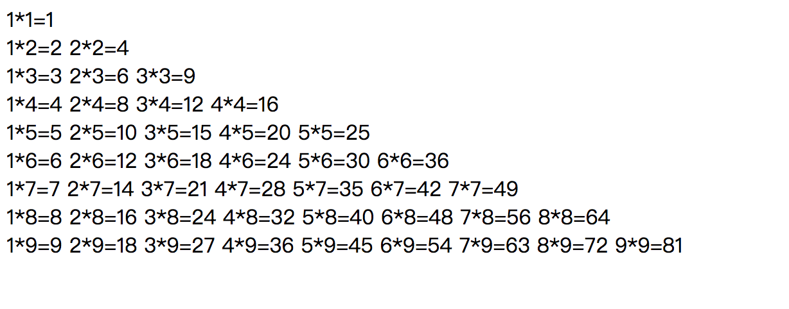
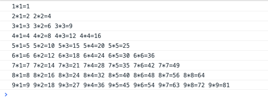
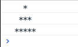
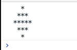
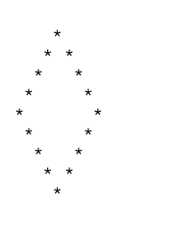
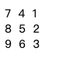
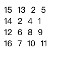

# js循环语句练习


#### 1. 实现下面的99乘法表

输出结果为：



解：JS代码如下

```
for(var a = 1;a < 10;a++){
    var str = ""
    for(var b = 1;b < a+1;b++){
        var tmp = a+'*'+b+'='+a*b + " "
        str += tmp
    }
    console.log(str)
}
```
预览：



#### 2. 实现下面的星星形状

	1.
	```javascript
	
	   *       
	  ***      
	 *****     
	*******    
	```

	2.提示：Math.ceil() 向上取整Math.abs()  取绝对值
	
	```javascript
	
	   *     
	  ***     
	 *****    
	  ***    
	   *    
	
	```
	
	3.
	
	```
	
	    *
	   * *
	  *   *
	 *     *
	*       *
	 *     *
	  *   *
	   * *
	    *
  
	```
解：代码如下：	

```
1.
var row=3; // row表示总行数
for(var r=1;r<=row;r++) { //外层循环控制行数 r表示每次变化的行数
    var triangle = ""; //triangle表示最后的三角形
    for (var space = r; space < row; space++) {//此循环控制空格数 space表示空格数
        triangle += " ";
    }
    for (var star = 1; star <= 2 * r - 1; star++) { //此循环控制 * 数 star表示*数
        triangle+="*";
    }
        console.log(triangle);

2.
var alt = "";
var _num = 3;
for(var i=1; i<=_num; i++){
    var blank = "";
    for(var j=1; j<=_num-i; j++){   //打印空格
        blank += " ";
    }
    var stars = "";
    for(var m=1; m<=2*i-1; m++){    //打印*
        stars += "*";
    }
    alt += blank + stars + "\n";   //字符串的拼接,拼为一行
}
for(var i=_num-1; i>0; i--){    //打印的行数要减1
    var blank = "";
    for(var j=1; j<=_num-i; j++){   //打印空格
        blank += " ";
    }
    var stars = "";
    for(var m=1; m<=2*i-1; m++){    //打印*
        stars += "*";
    }
    alt += blank + stars + "\n";   //字符串的拼接,拼为一行
}
console.log(alt); 

3.
for(var i=0;i<6;i++){
    for(var j=6;j>i;j--){
        document.writeln("&nbsp");
    }
    for(var k=1;k<=(2*i-1);k++){
        if(k==1 || k==(2*i-1)){
            document.writeln("*"); }
        else{ document.writeln("&nbsp");
        }
    }
    document.writeln("</br>"); }
for(var i=4;i>0;i--){
    for(var j=5;j>=i;j--){
        document.writeln("&nbsp");
    }
    for(var k=1;k<=(2*i-1);k++){
        if(k==1 || k==(2*i-1)){
            document.writeln("*"); }
        else{ document.writeln("&nbsp");
        }
    }
    document.writeln("</br>") }
   
```
预览：
1.



2.



3.


	
	
#### 3. 翻转图形

使正方形向右倒90度

给出算法函数

```

1.给出如下图形
[
  [1,2,3],
  [4,5,6],
  [7,8,9]
],

输出如下图形

[
  [7,4,1],
  [8,5,2],
  [9,6,3]
]
//---------//

2.给出如下图形 
[
  [ 5, 1, 9,11],
  [ 2, 4, 8,10],
  [13, 3, 6, 7],
  [15,14,12,16]
], 

输出如下图形
[
  [15,13, 2, 5],
  [14, 3, 4, 1],
  [12, 6, 8, 9],
  [16, 7,10,11]
]
```
解：

```
1.
var arr=[[1,2,3],[4,5,6],[7,8,9]];

//定义一个新的数组
var arr2=[];
for(var i=0;i<arr[0].length;i++){
    arr2[i]=[];
}
for(var i=0;i<arr.length;i++){
    for(var j=0;j<arr[i].length;j++){
        arr2[j][i]=arr[i][j];
    }
}

//成功！遍历arr2就是一个成功的数组
for(var i=0;i<arr2.length;i++){
    for(var j=0;j<arr2[i].length;j++){
        document.writeln(arr2[i][2-j]+"&nbsp");
    }
    document.writeln("<br/>");
}

2.
var arr=[[5,1,9,11],[2,4,8,10],[13,2,6,7],[15,14,12,16]];

var arr2=[];
for(var i=0;i<arr[0].length;i++){
    arr2[i]=[];
}
for(var i=0;i<arr.length;i++){
    for(var j=0;j<arr[i].length;j++){
        arr2[j][i]=arr[i][j];
    }
}

for(var i=0;i<arr2.length;i++){
    for(var j=0;j<arr2[i].length;j++){
        document.writeln(arr2[i][3-j]+"&nbsp");
    }
    document.writeln("<br/>");
}
```

预览：
1.



2.



#### 4. 排序

给出存数字数组 [1, 8, 3, 2, 9, 5, 4, 7]

返回排序后的值 [1, 2， 3， 4， 5， 7，8，9]

给出算法函数

解：

```
var arr=[1,8,3,2,9,5,4,7];
// 使用冒泡排序
var f=function (list) {
    for(var i=0;i<arr.length;i++){
        if(arr[i] > arr[i+1]){
            arr[i]=arr[i+1];
        }
    }
    for(var i=0;i<arr.length;i++){
        document.writeln(arr[i]);
    }
}

//执行
f(arr);
```

#### 5. 搜索

给出矩阵如

```

        var matrix = [
            [1, 3, 5, 7],
            [10, 11, 16, 20],
            [23, 30, 34, 50]
        ];

```
给出一个数字 如 50 如果50在矩阵之中 则返回 true

解：

```
var matrix = [
    [1, 3, 5, 7],
    [10, 11, 16, 20],
    [23, 30, 34, 50]
];

//查找函数，找到返回true,否则返回false
var f=function (list,n) {
    for(var i=0;i<list.length;i++){
        for(var j=0;j<list[0].length;j++){
            if(list[i][j]=n){
                return true
            }else {
                return false
            }
        }
    }
}

//查找50
var a=f(matrix)
document.writeln(a);
```