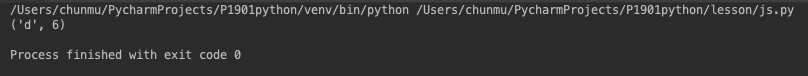
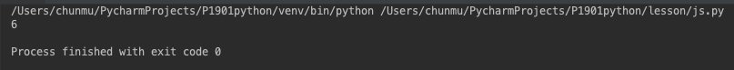
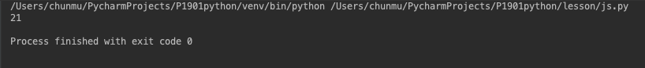
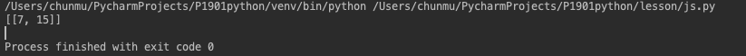

# js函数练习(算法,如果不熟练 可以使用python函数来完成,)


#### 1. 找到最大字符

给出字符串如 afjghdfraaaasdenas
返回最出现次数最多的 a和出现次数

解：

```
s = 'afjghdddddddfraaaasdenas'

def f1(s):
    n = 0
    b = " "
    for i in s:
        a1 = s.count(i)
        if a1 > n:
            n = a1
            b = i
    a2 = s.count('a')
    return b, a2

c = f1(s)
print(c)
```
运行结果：


#### 2. 使用二分查找某个数在数组中的位置

如：给出数组 [2,3,5,7,11,13,17,19,23,29,31, 37, 41,43,47];给出数字13，返回13在上面数组中的位置。

解：

```
def binary_search(list, item):
    low = 0
    high = len(list) - 1
    while low <= high:
        mid = (low + high) // 2
        guess = list[mid]
        if guess == item:
            return seach(list, item, mid)
        elif guess > item:
            high = mid - 1
        elif guess < item:
            low = mid + 1


def seach(list, item, mid):
    for k, v in enumerate(list[mid:]):
        if v == item:
            continue
        else:
            return k + mid

#找到13所在的下标
int1 = [2, 3, 5, 7, 11, 13, 17, 19, 23, 29, 31, 37, 41, 43, 47]
intItem = 13
a = binary_search(int1, intItem)
print(a)
```
运行结果：



#### 3. 台阶问题
一只青蛙要跳上n层高的台阶，一次能跳一级，也可以跳两级，请问这只青蛙有多少种跳上这个n层高台阶的方法？

解：

```
def jump(target):
    if target == 1:
        return 1
    elif target == 2:
        return 2;

    else:
        return jump(target - 1) + jump(target - 2)

# 7个台阶为例
s = jump(7)
print(s)
```
运行结果：


#### 4. 相加算法练习
给出一个数组 如 [2, 11, 7, 15] 再给出一个值 如 22 返回数组里面的和等于这个值的两个数的组合
如 fun([2, 11, 7, 15],22) == [7,15] ,fun([2, 11, 7, 15],13) == [2,11]
只考虑有两个数相加的情况,只考虑肯定会有解的情况,不考虑没有解的情况

解：

```
def total(arr, n):
    l1 = []
    l2 = []
    for i in range(len(arr)):
        
        for j in arr[i+1:]:
            if arr[i] + j == n:
                l2 = [arr[i], j]
                l1.append(l2)
    return l1
                
        
list1 = [2, 11, 7, 15]

s = total(list1, 22)
print(s)
```
运行结果：



