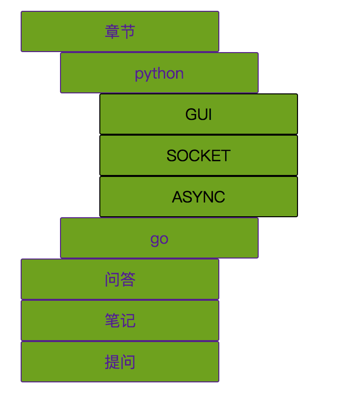
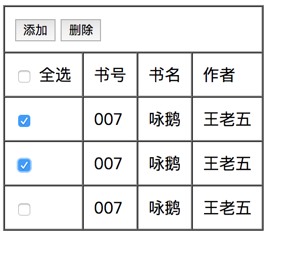
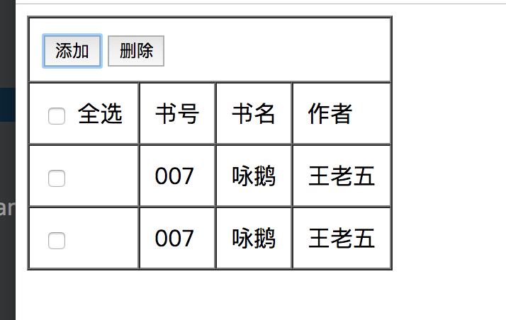
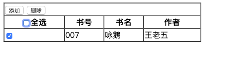

# 综合案例作业

1. 实现三级下拉菜单 (js版本)



解：
JS代码如下：

```
    <script>

        var t1 = document.getElementById("t1");
        t1.onmouseover = function () {
            var h2 = document.getElementsByClassName("h2");
            h2.style.display="inline-block";
        };

        var h2 = document.getElementById("h2");
        h2.onmouseover = function () {
            h2.style.display="inline-block";
        };

        var t2 = document.getElementById("t2");
        t2.onmouseover = function () {
            var h3 = document.getElementById("h3");
            h3.style.display="inline-block";
        };

    </script>
```

代码链接：
<a href="7_1.html">第一题作业7_1.html</a>

2. 实现一个添加和删除表

	1. 在选中后点击删除可以删除选中的栏
	
	

	2. 在点击添加的时候，可以添加一行数据(数据固定)
	
	
	
解：

代码链接：
<a href="7_2.html">第二题作业7_2.html</a>

预览：

