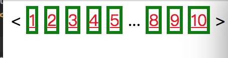
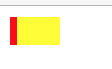
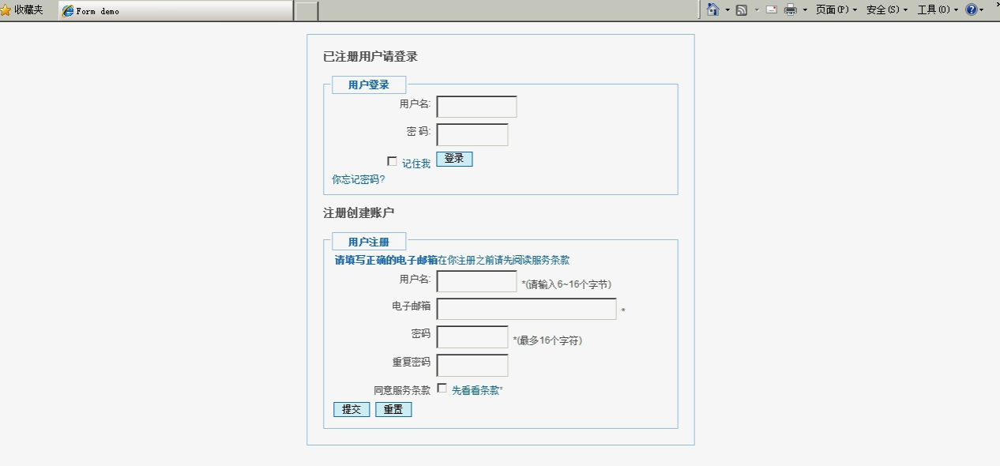

# CSS基础部分作业

请制作一个html页面作为作业

#### 1-11题:
<a href="home_work_css.html">点击修改这个网页里面的代码，给它加上样式</a>

所有的css使用外部定义方式。

```
1. 给这个页面加上title内容为:pxxxx_作业    5分
2. 假设第一篇文章的 Docker的应用场景 为本文章的标题 请给他加上语义化的标签  5分
3. 给第一篇文章下面的所有section里面的内容 字体颜色变为 红色 加粗 5分
4. 给第一篇文章的最后一个section 加上虚线形状的边框   5分
5. 给第一篇文章没有标签部分的文字给个你认为最能表示他语义化的标签   5分
6. 给第二篇文章里面的所有p标签给出绿色 (使用id选择器)   5分
7. 给第二篇文章的article标签所有的子div标签下面的子p标签 改变字体样式和颜色(黄色) （使用class选择器）  5分
8. 第三篇文章中有代码 请加上适合的标签  5分
9. 给输出第三篇第二行文字在页面中换行 并加上样式,鼠标移动过去改变颜色 5分
10. 第三篇文章文字  '以上命令完整的意思可以解释为：'  后面的文字分为了两行 在不删除div标签的情况下使他们成为一行 10分
11. 在后面自行写一含有个账户 密码 确认密码 提交按钮 重置按钮 的表单 提交地址随意  提交方法 POST方法 请给表单加上红色边框。
```

解：

html代码链接：
<a href="3_1.html">第一题作业3_1.html</a>

外部CSS代码链接：
<a href="3_1css.css">第一题作业3_1css.css</a>


2.分页代码 15分


解：

代码链接：
<a href="3_2.html">第二题作业3_2.html</a>


3.实现以下样式出来 5分



解：

实现代码如下：

```
<!DOCTYPE html>
<html lang="en">
<head>
    <meta charset="UTF-8">
    <title>Title</title>
    <style>
        #s1{
            background-color: red;
            padding:20px 10px;
        }
        #s2{
            background-color: yellow;
            padding:20px 40px;
        }
    </style>
</head>
<body>
<span id="s1"></span>
<span id="s2"></span>
</body>
</html>
```

4.实现下图 15分


解：

作业代码链接：
<a href="3_4.html">第四题作业3_4.html</a>
