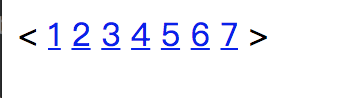

# 课后练习
1.使用html列表完成下面图片。


2.使用html完成下面图片。


作业连接：

3.完成下面的要求。


4.简答什么是html语义化。

```
答：
```

5.html标签和元素的区别。

```

```

6.简答浏览器获取网页的完整大体流程。

```

```

7.html、css、js的区别和功能是什么？

```
答：HTML控制网页的结构，CSS控制网页的外观，JavaScript控制网页的行为。
```

8.标记语言是什么意思?请再写出两种编辑语言并说明他们的用途。

```

```

9.h5播放器和flash播放器的有什么不同点。

```

```

10.如何区分HTML和HTML5。

```

```