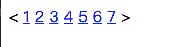

# 课后练习
1.使用html列表完成下面图片。


解：

代码链接：
<a href="1_1.html">第一题作业1_1.html</a>

2.使用html完成下面图片。


解：

代码连接：
<a href="1_2.html">第二题作业1_2.html</a>

3.完成下面的要求。


答：

代码连接：
<a href="./1_3/index.html">第三题作业index.html</a>


4.简答什么是html语义化。

```
答：有时候很多人由于不熟悉标签的语义，常常用某一个标签来代替另一个标签，虽然能达到相同的效果，但是这是一种错误的思想，例如，你可以用div来代替p，也可以用p来代替h1，但是这样却违背了html语言的初衷，HTML的精髓在于标签的语义。
	语义化，就是不同标签代表了不同的含义，是非常重要的一个思想，在整站的开发中，代码是成千上万行的，如果全部用div来实现，怎么样可以快速查找某行代码是否出错，可读性大打折扣，同时，语义化对于搜索引擎优化，也是极其重要的。
```

5.html标签和元素的区别。

```
答：元素就是HTML网页实际上就是由许许多多各种各样的HTML元素构成的文本文件，并且任何网页浏览器都可以直接运行HTML文件。所以可以这样说，HTML元素就是构成HTML文件的基本对象，HTML元素可以说是一个统称而已。HTML元素就是通过使用HTML标签进行定义的。而标签则是类似<head>、<body>、<table>等被尖括号“<”和“>”包起来的对象，绝大部分的标签都是成对出现的，如<table></talbe>、<form></form>。当然还有少部分不是成对出现的，如<br>、<hr>等。可以说标签就是元素，而元素不一定是标签。 
```

6.简答浏览器获取网页的完整大体流程。

```
答：一般可分为7个步骤：
1.在浏览器中输入网址；
2.发送至DNS服务器并获得域名对应的WEB服务器的IP地址；
3.与WEB服务器建立TCP连接；
4.浏览器向WEB服务器的IP地址发送相应的HTTP请求；
5.WEB服务器响应请求并返回指定的URL的数据，或错误信息，如果设定重定向，则重定向到新的URL地址。
6.浏览器下载数据后解析HTML源文件，解析的过程中实现对页面的排版，解析完成后在浏览器中显示基础页面。
7.分析页面中的超链接并显示在当前页面，重复以上过程直至无超链接需要发送，完成全部显示。
```

7.html、css、js的区别和功能是什么？

```
答：HTML控制网页的结构，CSS控制网页的外观，JavaScript控制网页的行为。
```

8.标记语言是什么意思?请再写出两种编辑语言并说明他们的用途。

```
答：标记语言，是一种将文本以及文本相关的其他信息结合起来，展现出关于文档结构和数据处理细节的电脑文字编码。与文本相关的其他信息（包括文本的结构和表示信息等）与原来的文本结合在一起，但是使用标记进行标识。
举例：
XML：可扩展标记语言（标准通用标记语言下的一个子集），又称可扩展置标语言，是一种标记语言。置标指电脑所能理解的信息符号，通过此种标记，电脑之间可以处理包含各种信息的文章等。
XHTML：可延伸超文件标记语言（Extensible HyperText Markup Language），是一种标记语言，表现方式与超文本标记语言类似，不过语法上更加严格。
```

9.h5播放器和flash播放器的有什么不同点。

```
答：HTML5的优点主要在于，开发周期短，开发成本低，且可以跨平台使用。与Flash技术相比，H5技术不但不需要插件、而且还是开发免费，以及对搜索引擎友好等特点更适应移动端开发的特点深受广大开发者的喜爱，但是对于不兼容H5技术的浏览器与屏幕的移动端，H5的表现也是非常糟糕的。
```

10.如何区分HTML和HTML5。

```
答：主要靠两点区分：
	1、在文档类型声明上
　　HTML的声明：<!DOCTYPE html PUBLIC "-//W3C//DTD XHTML 1.0 Transitional//EN" "http://www.w3.org/TR/xhtml1/DTD/xhtml1-transitional.dtd">
　　HTML5声明：<!doctype html>
　　由此可见,HTML5声明简洁方便人们的记忆，HTML声明太长了并且很难记住这段代码。
　　2、在结构语义上
　　HTML:没有体现结构语义化的标签，通常都是这样来命名的<div id="header"></div>，这样表示网站的头部。
　　HTML5:在语义上却有很大的优势，提供了一些新的HTML5标签比如: article、footer、header、nav、section，这些通俗易懂。 
```