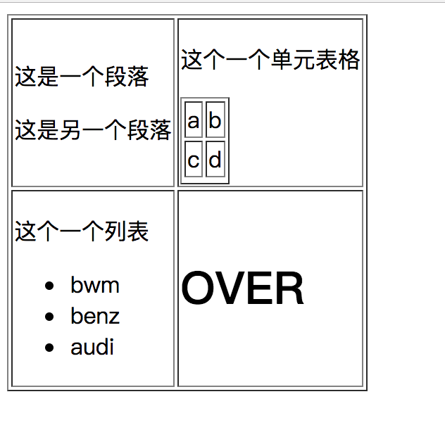
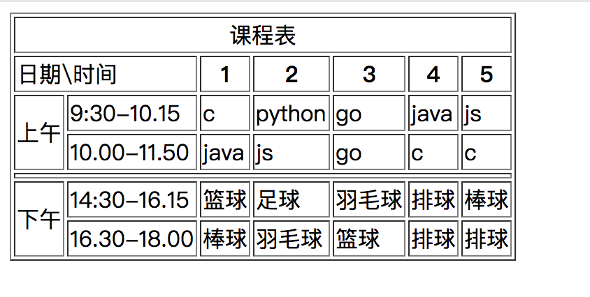
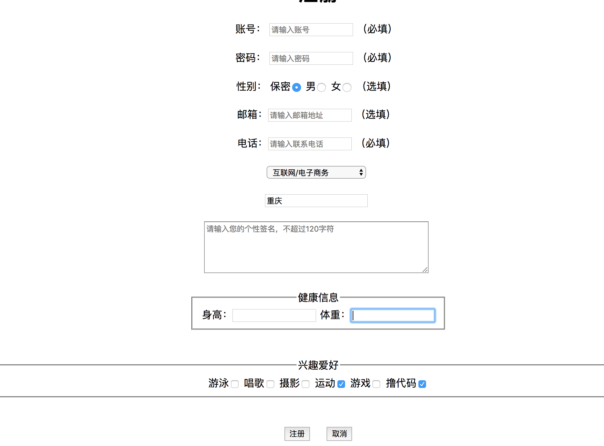
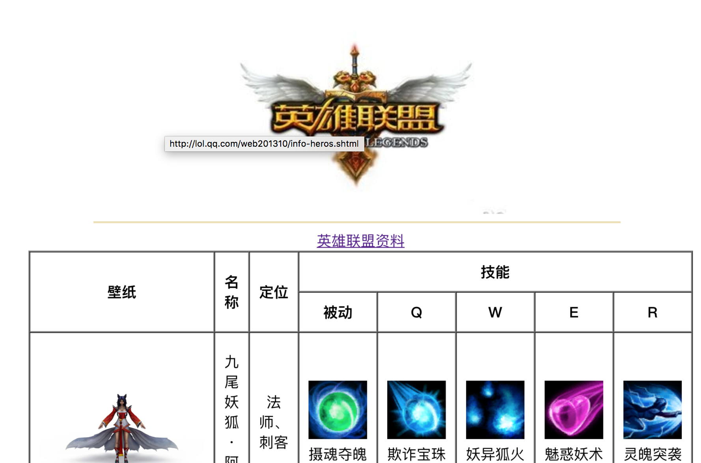

## 课后练习

#### 使用表格或者表单完成下面图表

1.

解：

代码链接：
<a href="2_1.html">第一题作业2_1.html</a>

2.

解：

代码链接：
<a href="2_2.html">第二题作业2_2.html</a>

3.

解：

代码链接：
<a href="2_3.html">第三题作业2_3.html</a>

4.完成下图

解：

代码链接：
<a href="2_4.html">第四题作业2_4.html</a>

