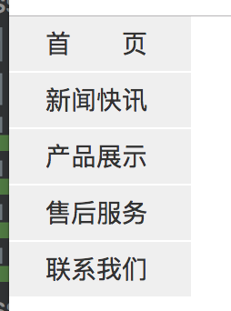
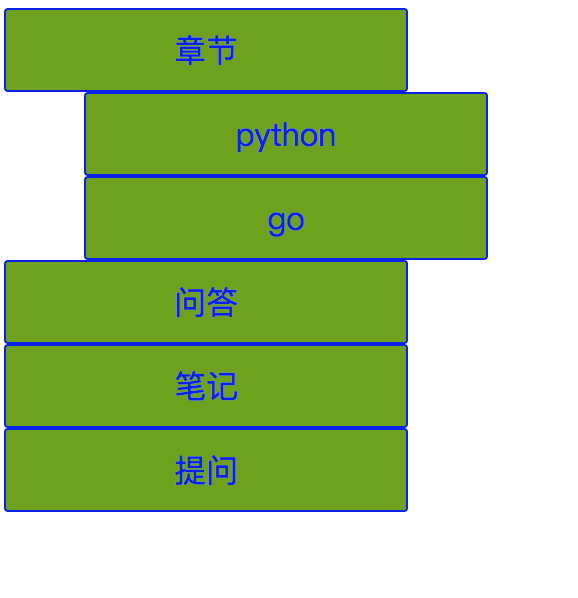

# 案例作业

## 1. 垂直导航栏


要求 鼠标过导航栏变颜色



解：

代码链接：
<a href="4_1.html">第一题作业4_1.html</a>

## 2. 把上面例子放水平

解：直接在第一题style标签中加入下面这句代码即可：

```
display: inline-block;

```
代码链接：
<a href="4_2.html">第二题作业4_2.html</a>


## 3. 实现三级下拉菜单

#### 说明

1. 鼠标移动到章节 下拉出 python go 菜单
2. 鼠标移动到下拉出来的python 出现 GUI SOCKET等菜单




解：

代码链接：
<a href="4_3.html">第三题作业4_3.html</a>