# MySQL_阶段作业1
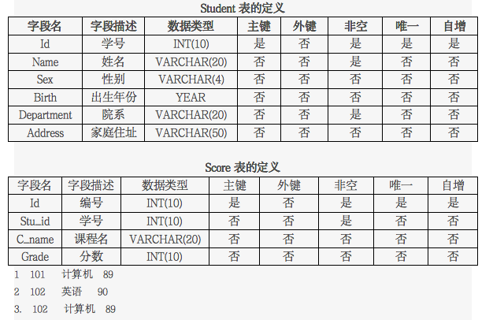

### 根据题意，最终创建并添加数据后的两张表分别为:

##### student表：
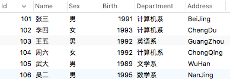

##### score表：
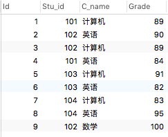

##### 完成作业过程如下：
1.创建student和score表。

```
创建student表：
CREATE TABLE `student`
(
Id INT(10) PRIMARY KEY AUTO_INCREMENT,
Name VARCHAR(20) NOT NULL,Sex VARCHAR(4),
Birth YEAR,
Department VARCHAR(20) NOT NULL,
Address VARCHAR(50)
); 

创建score表：
CREATE TABLE `score`
(
Id INT(10) PRIMARY KEY AUTO_INCREMENT,
Stu_id INT(10) NOT NULL,
C_name VARCHAR(20),
Grade INT(10)
); 
```

2.为student表和score表增加记录。

```
student表增加部分信息：
INSERT INTO student(Id,Name,Sex,Birth,Department,Address) VALUES
(101,'张三','男',1991,'计算机系','BeiJing'),
(102,'李四','女',1993,'计算机系','ChengDu'),
(103,'王五','男',1992,'英语系','GuangZhou')，
(104,'周六','女',1992,'计算机系','ChongQing')；
  
score表增加部分信息：
INSERT INTO score(Stu_id,C_name,Grade) VALUES
(101,'计算机',89),
(102,'英语',90),
(102,'计算机',89);
```

3.查询student表的所有记录。

```
SELECT * FROM student；
```
执行结果如下：

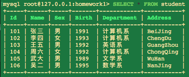

4.查询student表的第2条到4条记录。

```
SELECT * FROM student LIMIT 1,3； 
```
执行结果如下：

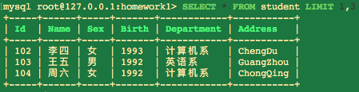

5.从student表查询所有学生的学号（id）、姓名（name）和院系（department）的信息。

```
SELECT Id,Name,Department FROM student;
```
 执行结果如下：

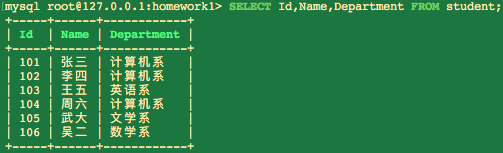

6.从student表中查询计算机系和英语系的学生的信息。

```
SELECT * FROM student WHERE Department = '计算机系' 
OR Department = '英语系'； 
```
 执行结果如下：

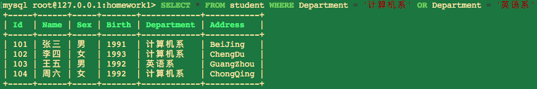

7.从student表中查询年龄18~22岁的学生信息。

```
SELECT * FROM student where 
YEAR(CURDATE()) - Birth >= 18 
and YEAR(CURDATE()) - Birth <= 22；
```
执行结果如下：
以查询26至28之间为例。

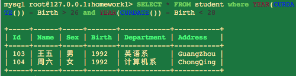
  
8.从student表中查询每个院系有多少人。

```
SELECT Department,count(*) FROM student GROUP BY Department;
```
执行结果如下：

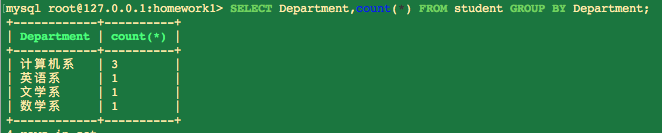
 
10.查询李四的考试科目（c_name）和考试成绩（grade）。

```
SELECT * FROM student AS a JOIN score AS b ON a.ID=b.Stu_id 
WHERE Name='李四'; 
```
执行结果如下：

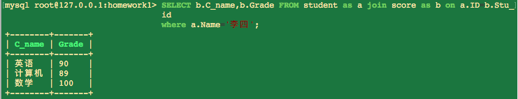

11.用连接的方式查询所有学生的信息和考试信息。

```
SELECT * FROM student AS a JOIN score AS b ON 
a.ID=b.Stu_id ORDER BY a.Id
```
执行结果如下：

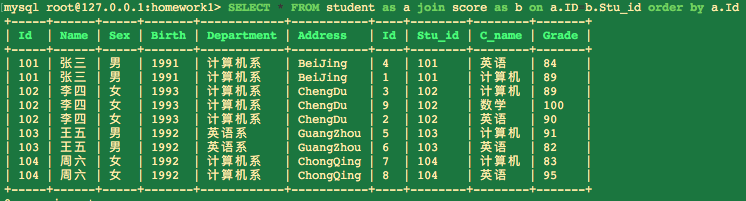

12.计算每个学生的总成绩。

```
SELECT a.Name,SUM(b.Grade) FROM student AS a JOIN 
score AS b ON a.ID=b.Stu_id GROUP BY a.Name 
```

执行结果如下：

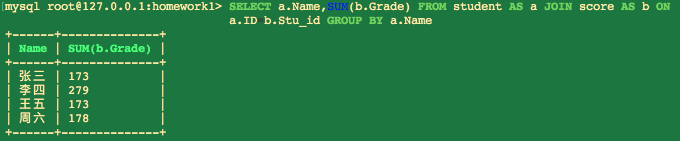
                                
13.计算每个考试科目的平均成绩。

```
SELECT b.C_name,AVG(b.Grade) FROM student AS a JOIN 
score AS b ON a.ID=b.Stu_id GROUP BY b.C_name
```
执行结果如下：

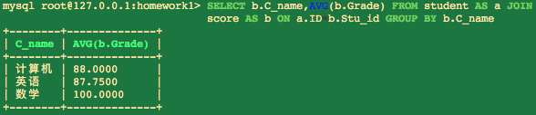

14.查询计算机成绩低于95的学生信息。

```
SELECT * FROM student AS a JOIN 
score AS b ON a.ID=b.Stu_id WHERE b.C_name = '计算机' AND b.Grade < 95
```
执行结果如下：

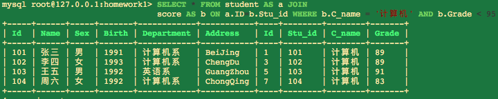

15.查询同时参加计算机和英语考试的学生的信息。

```
SELECT distinct a.* FROM student AS a JOIN score AS b 
ON a.ID=b.Stu_id WHERE C_name in('计算机','英语') ORDER BY a.Id 
```
执行结果如下：

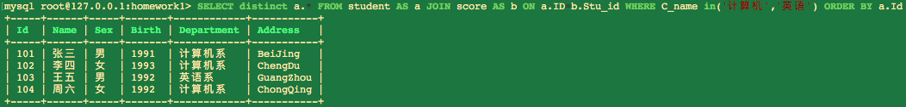

16.将计算机考试成绩按从高到低进行排序。

```
SELECT b.Grade FROM student AS a JOIN score AS b ON a.ID=b.Stu_id 
WHERE C_name = '计算机' ORDER BY Grade DESC
```
执行结果如下：

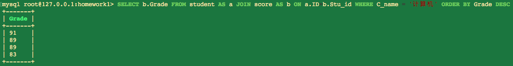

18.查询姓张或者姓王的同学的姓名、院系和考试科目及成绩。

```
SELECT a.Name,a.Department,b.C_name,b.Grade FROM student AS a 
JOIN score AS b ON a.ID=b.Stu_id WHERE a.Name REGEXP '^[王张]'
```
执行结果如下：

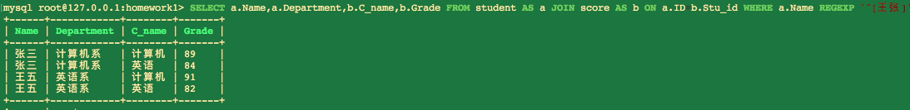

19.查询都是湖南的学生的姓名、年龄、院系和考试科目及成绩。

```
SELECT 
a.Name,
(YEAR(CURDATE()) - a.Birth) as Age,
Department,
b.C_name,
b.Grade 
FROM 
student AS a JOIN score AS b 
ON a.ID=b.Stu_id 
WHERE a.Address = '湖南' 
```
执行结果如下：

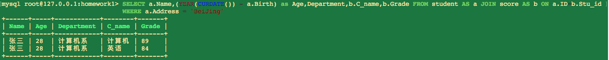

20.把张三的姓名改为张三丰，课程改为java 分数100。

```
将张三的姓名改为张三丰，计算机课程改为java，且该科目分数改为100:
UPDATE 
score JOIN student ON score.Stu_id = student.Id 
SET 
student.Name = '张三丰',score.C_name = 'java',score.Grade = 100
WHERE
student.Name = '张三' AND score.C_name ='计算机'; 
查看更改结果：
SELECT * FROM score JOIN student ON score.Stu_id = student.Id;
```
执行结果如下：

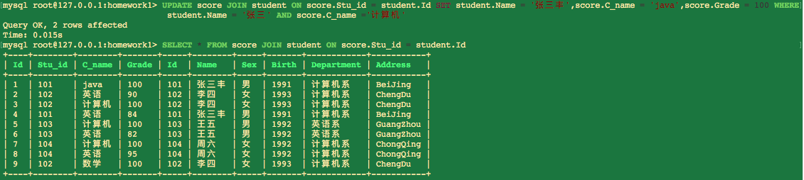