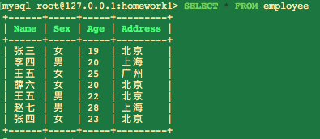

# MySQL_阶段作业2
已知：员工信息表，表名为：employee。


根据题意，先创建employee表：

```
CREATE TABLE `employee`
(
Name varchar(255),
Sex varchar(5),
Age int(10),
Address varchar(255));

INSERT INTO employee VALUES
('张三','女',19,'北京'),
('李四','男',20,'上海'),
('王五','女',25,'广州'),
('薛六','女',20,'北京'),
('王五','男',22,'北京'),
('赵七','男',28,'上海'),
('张四','女',23,'北京'); 
```
执行结果如下：



1.写出sql语句，查询所有年龄大于20岁的员工（2分）

```
SELECT * FROM employee WHERE Age > 20; 
```
执行结果如下：


2.写出sql语句，查询所有年龄小于25岁的女性员工（3分）

```
SELECT * FROM employee WHERE Age < 25; 
```
执行结果如下：


3.写出sql语句，统计男女员工各有多少名（3分）

```
SELECT Sex,COUNT(Sex) AS Number FROM employee 
GROUP BY Sex; 
```
执行结果如下：


4.写出sql语句，按照年龄倒序获取员工信息（3分）

```
SELECT * FROM employee ORDER BY Age DESC; 
```
执行结果如下：


5.写出sql语句，获取员工中哪个姓名具有重名现象（3分）

```
SELECT Name,COUNT(Name) AS Number FROM employee 
GROUP BY Name 
HAVING COUNT(Name) > 1; 
```
执行结果如下：


6.写出sql语句，查询所有姓张的员工（3分）

```
SELECT * FROM employee WHERE Name LIKE '张%'; 
```
执行结果如下：


7.写出sql语句，查询住址为北京的前3条记录（3分）

```
SELECT * FROM employee WHERE Address = '北京' 
LIMIT 3; 
```
执行结果如下：


8.写出sql语句，查询员工总数（3分）

```
SELECT COUNT(*) as People FROM employee; 
```
执行结果如下：


9.写出sql语句，向表中插入一条记录（2分）

```
INSERT INTO employee VALUES
('周六','女',20,'成都');
```
执行结果如下：


10.写出sql语句，修改员工张四的住址为南京（2分）

```
UPDATE employee SET Address = '南京' 
WHERE Name = '张四'; 
```
执行结果如下：


11.写出sql语句，删除年龄大于24岁的女员工（2分）

```
DELETE FROM employee WHERE Age > 24;
```
执行结果如下：

