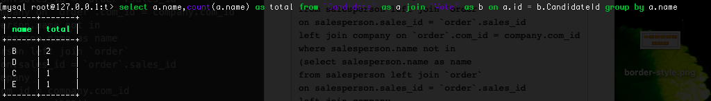

# MySQL_考试
1.

```
select b.teat_id from train as a join train as b where (b.teat_id - 1) = a.teat_id and a.is_free = 1 and b.is_free = 1
```
预览：


2.

```
select a.name as name,b.bonus as bonus from 
employee as a left join bonus as b 
on a.empid = b.empid 
where b.bonus < 1000 or b.bonus is null 
order by a.name desc;
```
预览：


3.

```
select distinct salesperson.name as name 
from salesperson left join `order` 
on salesperson.sales_id = `order`.sales_id 
left join company on `order`.com_id = company.com_id 
where salesperson.name not in 
(select salesperson.name as name 
from salesperson left join `order` 
on salesperson.sales_id = `order`.sales_id 
left join company 
on `order`.com_id = company.com_id 
where company.name = 'RED') ;
```
预览：


4.

```

```

5.

```
select a.name,count(a.name) as total from `Candidate` as a join `Vote` as b on a.id = b.CandidateId group by a.name 
```
