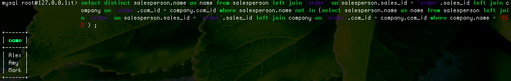

# MySQL_考试
1.

```
SELECT DISTINCT a.teat_id from train a JOIN train b ON abs(a.teat_id-b.teat_id) = 1 WHERE a.is_free=1 AND b.is_free=1 ORDER BY a.teat_id;
```
预览：


2.

```
select a.name as name,b.bonus as bonus from 
employee as a left join bonus as b 
on a.empid = b.empid 
where b.bonus < 1000 or b.bonus is null 
order by a.name desc;
```
预览：


3.

```
select distinct salesperson.name as name 
from salesperson left join `order` 
on salesperson.sales_id = `order`.sales_id 
left join company on `order`.com_id = company.com_id 
where salesperson.name not in 
(select salesperson.name as name 
from salesperson left join `order` 
on salesperson.sales_id = `order`.sales_id 
left join company 
on `order`.com_id = company.com_id 
where company.name = 'RED') ;
```
预览：


4.

```
select distinct n1.id,if(n1.p_id is null,'Root',if(n2.id is null,'Leaf','Inner')) as node from node n1 left join node n2 on n1.id=n2.p_id
```

5.

```
select name from candidate where id =(select candidateid as id from vote group by candidateid ORDER BY  count(*) desc limit 0,1 )
```