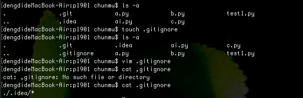

# git 作业

1.git add和git stage的区别是什么。

```
答：本质上git add 和git stage没有任何区别，只是官方推荐使用git stage。
```

2.git rm --cached 和git rm -f的区别是什么。

```
答：当我们需要删除暂存区或分支上的文件, 但本地又需要使用, 只是不希望这个文件被版本控制, 可以使用 git rm --cached，git rm --cached 会从index里面删除该文件，下次commit的时候会修改git仓库，但是本地的文件还是保留；而使用git rm -f，会将文件从暂存区中删除，并且删除原文件。
```

3.git和svn的区别是什么。

```
答：
1.GIT是分布式的，SVN不是分布式；
2.GIT把内容按元数据方式存储，而SVN是按文件方式存储；
3.GIT的分支很容易被发现并进行操作，而SVN不易发现分支，从而造成分支遗漏；
4.GIT没有一个全局的版本号，而SVN有；
5.GIT的内容完整性要优于SVN，GIT的内容存储使用的是SHA-1哈希算法，这能确保代码内容的完整性。
```

4.筛选出 2018.10.1 到 2018.10.20之间的日志,并且输出为地理图,并且没有做过合并。

```
执行：
    $ git log --before="2018-10-20" --since="2018-10-1" \
      --no-merges --graph
```

5.git init和git clone的区别。

```
答：使用git init 是初始化本地的仓库，会生成.git文件，此时不会加入任何文件的快照，而使用git clone 是克隆远程仓库到当前文件夹，同时也会一起克隆远程的文件夹。
```

6.每次提交都忽略.idea文件夹里面的东西怎么办。

```
答：1.在git管理的当前工作目录下，新建一个名为.gitignore的文件;
   2.使用vim编辑.gitignore忽略当前目录下的.idea文件夹里面的东西，内容为./.idea/*，保存并提交。
   3.可以使用cat .gitignore语句查看当前忽略条件，设置好后每次提交时就会自动忽略当前文件目录下.idea文件夹里面的东西。
```



7.如果编辑一个文件之后并且加入了暂存区,但是你后悔了,想把文件恢复到没有修改之前的样子,怎么办。

```
答：如果已经加入了暂存区，则要先使用:
      $ git reset HEAD <file>... 
   来取消<file>文件的暂存状态，文件恢复到已修改但为暂存状态，
   此时若需要恢复到没有修改之前的样子，执行：
      $ git checkout -- <file>...
   即可将文件恢复到没有修改之前的样子。
```

8.如何检出标签?

```
答：如果你想查看某个标签所指向的文件版本，可以使用git checkout命令：
       $ git checkout <tagname>
```

9.git fetch 和 git pull的区别。

```
答：fecth 和pull的区别：git fetch命令会将数据拉取到你的本地仓库，但它并不会自动合并或修改当前的工作。 当准备好时你必须手动将其合并入你的工作。而git pull 通常会从最初克隆的服务器上抓取数据并自动尝试合并到当前所在的分支。
```

10.如何添加远程仓库。

```
答：运行 $ git remote add <shortname> <url> 即可添加一个新的远程 Git 仓库，其中<url>为远程仓库地址，<shortname>则可以理解为是本地的远程仓库别名，并且可以使用git remote -v 查看远程仓库信息。
```

