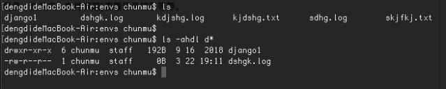
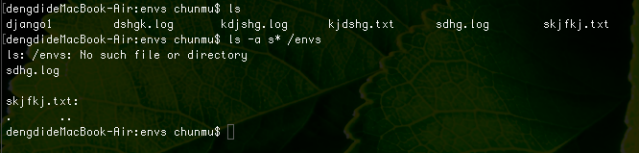
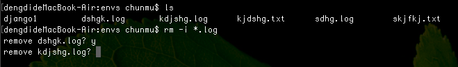
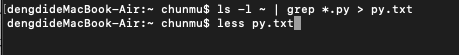
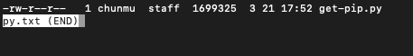
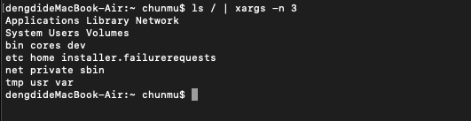
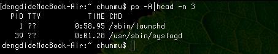
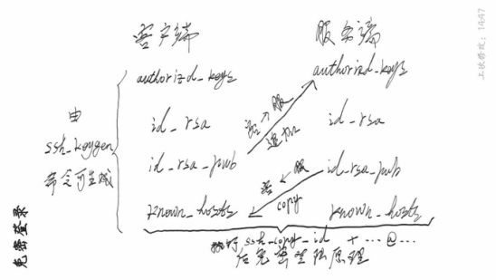
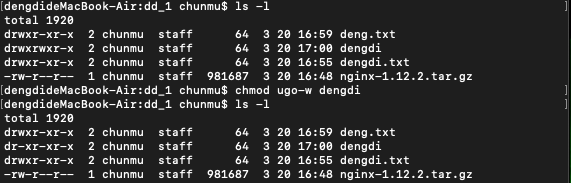

# linnux作业
1.以容易理解的格式列出/home目录中所有以”d”开头的文件目录的大小。

```
$ ls -ahdl d* /home
```
例：



2.列出/home 目录中所有以”s”开头的目录。

```
$ ls -a s* /home
```
例：



3.删除后缀名为.log 的所有，删除前逐一询问。

```
$ rm -i *.log
```
例：



4.cp命令 -n 和 -u的区别。

```
-n: 不要覆盖已存在的文件，并且使前面的-i（覆盖前询问）命令失效。
-u: 当将文件从一个目录复制到另一个目录时，只会复制那些目标目录中不存在的文件或者是目标目录相应文件的更新文件。
```

5.找你的用户目录下面的所有py文件,ls -l 查看他们的属性,然后把这些结果输入到一个文件之中.

```
$ ls -l ~ | grep *.py > py.txt
$ less py.txt
```
例：





6.使用ls查看根目录 并且每行显示3个信息。

```
$ ls / | xrags -n 3
```
例：



7.查看所有进程信息,只查看前3行。

```
$ ps -A | head -n 3
```
例：



8.分析以下问题,并给出解决方案。

```
Mount is denied because the NTFS volume is already exclusively opened.
The volume may be already mounted, or another software may use it which could be identified for example by the help of the 'fuser' command.

```
```
答：原因：挂载被拒绝，因为NTFS卷已经被打开。
   解决方式：可以通过“fuser”命令找到挂载点，如果需要，可以使用fuser -k +挂载路径将进程kill掉，再重新尝试挂载。
```

9.ssh 服务端口是多少,ssh免密登录方式的原理是什么。

```
答：ssh默认端口号是22。但在实际应用的时候可能会根据需要更改ssh的默认端口号。免密登录方式的原理是基于RSA算法，其简单的原理可表示成如下图：
```


```
   在客户端执行ssh-copy-id +服务器名@服务器ip地址，即可自动将客户端的公钥（id-rsa-pub）追加到服务端的authorizd-keys中，而服务器端会将自己的公钥复制到客户端的known-hosts中，每次登录时由客户端的私钥进行解密，即可进行免密登录。
```

10.权限755代表什么权限,如果我想把所有的w权限去除应该使用什么命令.

```
答：权限755代表u = rwx, g = r_x, o = r_x；把所有的w权限去除，使用“chmod ugo-w +文件名”命令即可；如：
```




